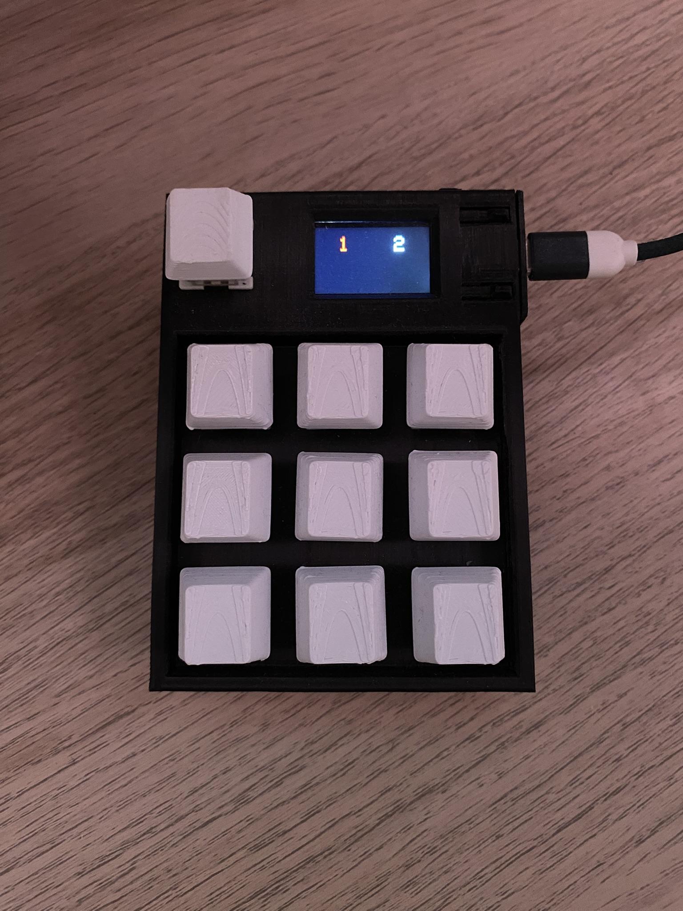
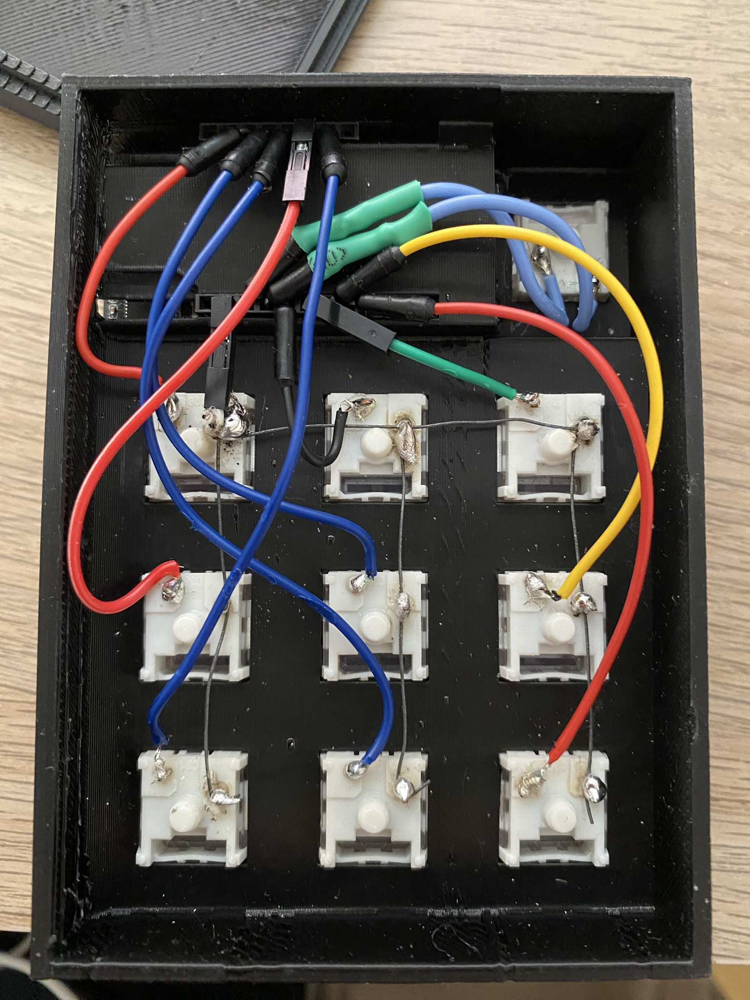

# Macro-Pad T-Display ESP32

## Table of Contents
- [Overview](#overview)
- [Photos](#photos)
- [Features](#features)
- [Resources](#resources)
- [Usage](#Usage)
- [In Planing](#In-Planing)

## Overview

- A 9x9 macro pad with an LCD screen, built using an ESP32 T-Display as the controller and screen.  
- I bought the ESP32 T-Display on AliExpress, programmed the board, designed the 3D model, and soldered everything together.  
- For the case, I started with a 3D model from Thingiverse for the ESP32 T-Display and built my own design around it.  

## Photos

## Features

- 18 programmable buttons using 9 physical switches + 1 mode switch (for switching between “slides”).  
- Each slide gives the buttons a different set of functions.  
- When a button is pressed, the screen displays a text description the action. (Firefox, Vol. Down, YouTube ...)
- One of the two small physical buttons on the ESP32 T-Display is used as a mode toggle:  
  - In normal mode, the large buttons work as macros.  
  - In “click mode,” button presses don’t trigger macros, but the text feedback is still shown on the screen.  

## Resources

- [Thingiverse Model](https://www.thingiverse.com/thing:4854469)  
- [AliExpress – ESP32 T-Display](https://de.aliexpress.com/item/1005005970553639.html?spm=a2g0o.order_list.order_list_main.50.364e5c5fjHIOAa&gatewayAdapt=glo2deu)

## Usage

- For each button, a keyboard shortcut needs to be made on the desktop so that when your desktop recognizes a specific keyboard input, it performs a task. 

## In Planing

- I am planning to add a special Python app that runs on the desktop to change the button capability and text. It will use serial. 
- Making tasks like volume up, volume down, mute, and more run directly over the ESP32 and not over a keyboard shortcut. 
