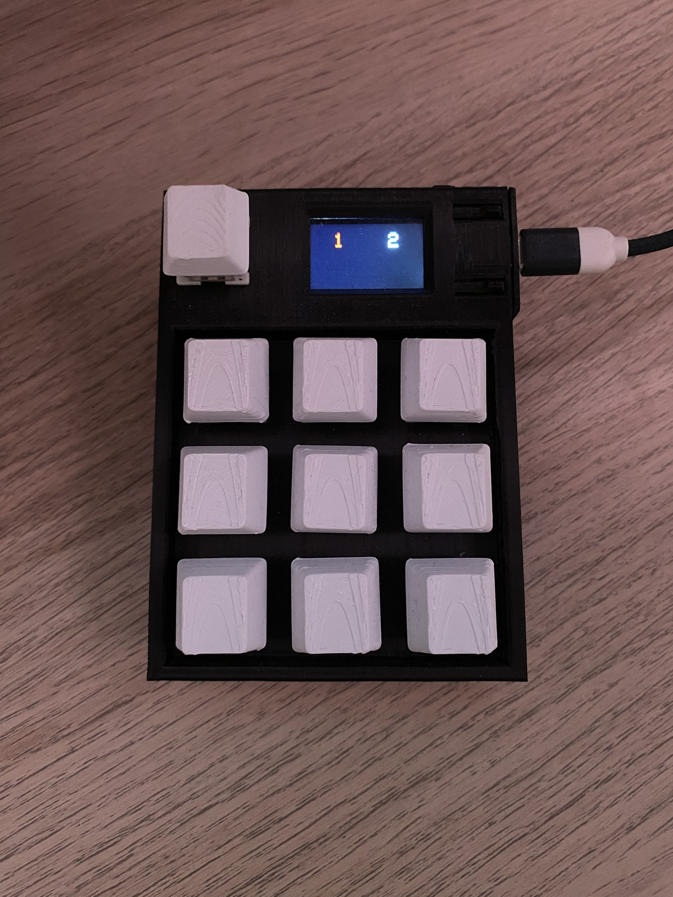
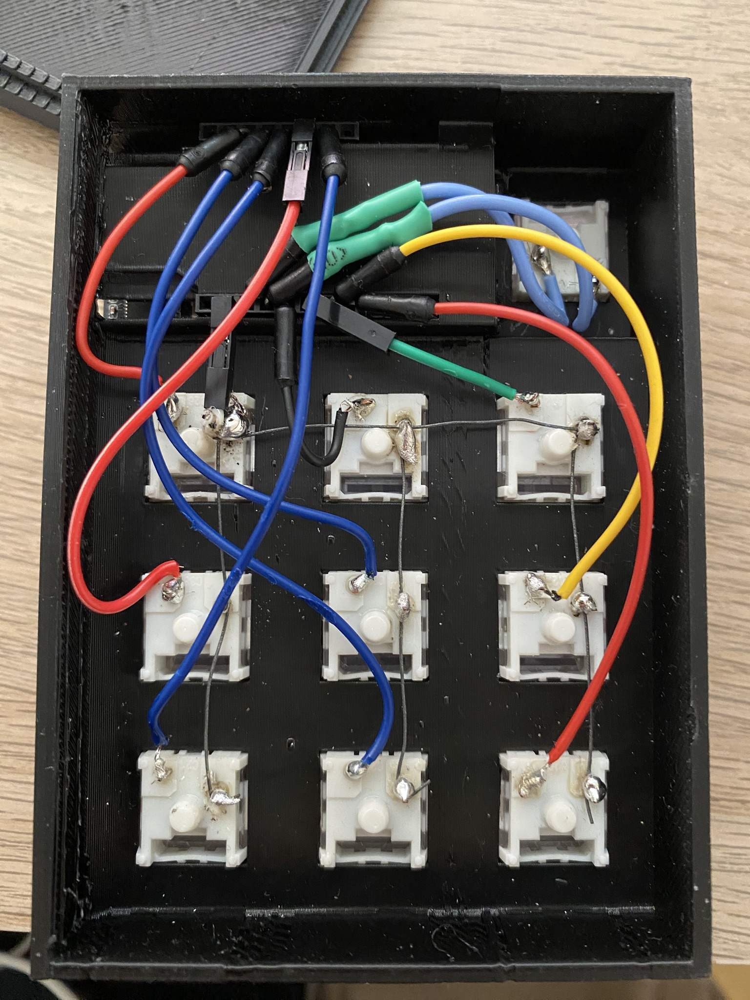

# Macro-Pad T-Display ESP32

# A 9x9 macro pad with an LCD screen


> A 9x9 macro pad with an LCD screen. It uses an ESP32 T-Display as the controller and a screen. 


## 📸 Pictures





## Features
- 18 programmable buttons that uses 9 physical switches and one switch for switching the slide. 

- On each slide a button has a different function.

<!-- ## 📖 About

Write a clear explanation of your project here.  
Example:
> This project is a tool that automates XYZ using Python.  
> It helps save time, reduce errors, and make development more fun.

## 🛠 Installation

```bash
# Clone the repository
git clone https://github.com/USERNAME/REPO.git

# Enter the project directory
cd REPO

# Install dependencies
npm install  # or pip install -r requirements.txt -->
